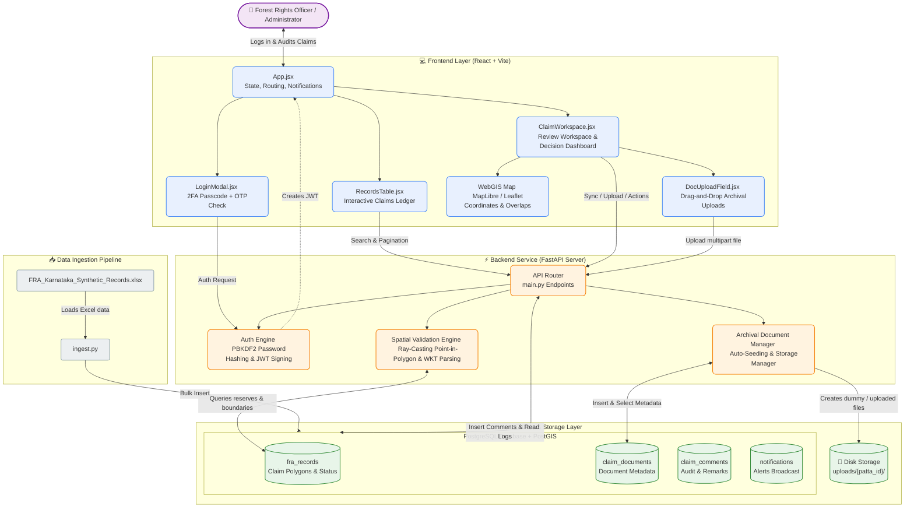

# TerraClaim: Forest Rights Act (FRA) Spatial Ledger & Dashboard

TerraClaim is a desktop-grade spatial ledger and decision support dashboard for monitoring, evaluating, and reviewing land claims under the **Forest Rights Act (FRA), 2006** (specifically for Karnataka). It allows administrators and Forest Rights Officers to visualizes spatial claims, query statistical metrics, evaluate program eligibility using a built-in Decision Support System (DSS), review individual records, and generate digital Patta Certificates.

---

# 🏗️ System Architecture

The following diagram illustrates the relationship between the dataset ingestion pipeline, database storage, Python FastAPI server, and the React + Vite frontend dashboard:



---

## ✨ Features

- 🗺️ **Interactive Spatial Map**: Maplibre GL integration displaying geolocated Individual (IFR), Community (CR), and Community Forest Resource (CFR) claims, color-coded by claim status.
- 📊 **Dynamic Analytics**: Summary dashboard featuring metrics such as total land claimed (in acres), ratio of granted vs. rejected files, and breakdowns by tribal community and district.
- 🔍 **Elastic Search**: Instantly look up claims by Patta ID, claimant name, tribal community, village, or district.
- 🗄️ **Archival Document Manager**: Automatically checks, seeds, and tracks verification documents from previous stages (Aadhaar, Land records, Survey sketches, Form applications) with a manual **Sync Previous Stage Docs** refresh.
- 💡 **Decision Support System (DSS)**: Automatically computes eligibility for 7 central and state schemes (e.g., PM-KISAN, MGNREGA, JJM, PMAY-G, PMFBY, NSTFDC, DAJGUA) based on applicant's claim metadata.
- 📝 **Workflow Review & Audit**: Inline review modal to update verification dates (Gram Sabha, SDLC, DLC) and final status (Title Granted/Rejected), persisting updates directly to the PostgreSQL database.
- 📜 **Digital Patta Generator**: Automatically compiles official digital land title certificates with unique QR codes, state seals, and signatures for claimants with "Title Granted" status.
- 📚 **Compliance & Guidelines**: Embedded reference manual explaining legal acts, application criteria, and claim verification processes under the FRA.

---

## 🛠️ Installation & Setup

### 1. Prerequisites
- **Python** (version 3.10 or higher)
- **Node.js** (version 18 or higher) & **npm**
- **PostgreSQL** with the **PostGIS** extension installed

### 2. Database Configuration
1. Initialize a PostgreSQL database named `fra_atlas`:
   ```sql
   CREATE DATABASE fra_atlas;
   ```
2. Enable the PostGIS spatial extension in your database:
   ```sql
   \c fra_atlas;
   CREATE EXTENSION IF NOT EXISTS postgis;
   ```
3. Run the setup script:
   ```bash
   psql -U postgres -d fra_atlas -f setup_db.sql
   ```

### 3. Data Ingestion
Run the python data ingestion script to read and populate the database from the synthetic records spreadsheet:
```bash
python ingest.py
```

### 4. Backend Setup (FastAPI)
1. Install Python backend dependencies:
   ```bash
   pip install -r requirements.txt
   ```
2. Run the development API server:
   ```bash
   uvicorn main:app --reload --port 8000
   ```

### 5. Frontend Setup (React + Vite)
1. Navigate to the frontend directory and install npm packages:
   ```bash
   cd frontend
   npm install
   ```
2. Start the Vite React development server:
   ```bash
   npm run dev
   ```

---

## 📂 Project Structure

```text
├── frontend/                     # React + Vite Client Dashboard
│   ├── src/
│   │   ├── components/           # Sub-modules (Analytics, DSS, Map, PattaCertificate, etc.)
│   │   ├── App.jsx               # App entrypoint and layout framework
│   │   └── index.css             # Main stylesheet
├── main.py                       # FastAPI backend server API
├── ingest.py                     # Database ETL ingestion script
├── setup_db.sql                  # Database initialization script
├── requirements.txt              # Python requirements
└── README.md                     # Project documentation
```
